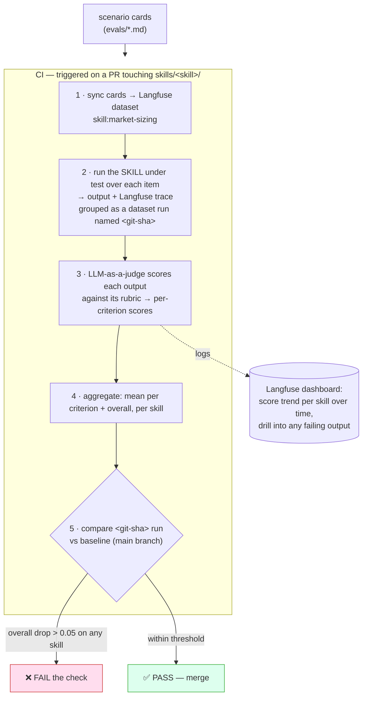

# PM Skills — Eval Pipeline (Langfuse)

*How we prove a skill's output is good, and catch regressions when we edit it. Two layers: fast structural lint in CI, and output-quality evals on Langfuse.*

Date: 2026-08-05 · Owner: Jeremie

## The two layers

| Layer | Question it answers | Where | Speed | Gate |
|---|---|---|---|---|
| **Structural lint** | Is the skill well-formed? (name==dir, frontmatter valid, *has Output Contract + Validation sections*) | local `validate_plugins.py` in CI | seconds | blocking |
| **Output eval** | Is the skill's *output* actually good, and did this edit make it worse? | **Langfuse** datasets + experiments + LLM-judge | minutes | regression threshold |

Layer 1 is a fork of phuryn's validator, extended to *require* the two sections your standard adds. Layer 2 is the new part.

---

## What you need (one-time setup)

1. **Langfuse access** — your work instance URL + a project, with `LANGFUSE_PUBLIC_KEY`, `LANGFUSE_SECRET_KEY`, `LANGFUSE_HOST` stored as CI secrets (and in a local `.env`). **Cloud vs self-hosted makes no difference to the pipeline** — the SDK is identical; you just point `LANGFUSE_HOST` at your instance. Your self-hosted one is fine (see the self-hosted note below).
2. **The runner model creds** — an API key for the model that *runs the skill under test* (the system under test) and one for the *judge* model (can be the same key, ideally a different/stronger model as judge).
3. **`langfuse` Python SDK** in the repo's dev deps.
4. **Per-skill `evals/` folder** with scenario cards (schema below).
5. **A shared judge rubric template** — the skill's own Quality-Bar, expressed as scorable criteria.

That's it — no new infra to run; Langfuse is the datastore + judge + dashboard.

---

## The scenario card (the unit of testing)

One markdown+frontmatter file per scenario, in `skills/<skill>/evals/`:

```markdown
---
id: market-sizing-b2b-saas-eu          # stable, unique — the Langfuse dataset-item key
skill: market-sizing
input:                                  # what the skill receives
  prompt: "Size the market for an EU SMB e-signature tool."
  context: "Bottom-up preferred. ~24M EU SMBs. Anchor pricing €15/mo."
expected:                               # characteristics a good output MUST have (feeds the judge)
  - "Reports TAM, SAM, and SOM as three distinct numbers"
  - "Shows both top-down AND bottom-up, and reconciles them"
  - "States every key assumption explicitly with a source or caveat"
  - "SOM is a defensible fraction of SAM, not a round guess"
rubric:                                 # scored criteria → weight (sums to 1.0)
  correctness: 0.35     # numbers follow from stated assumptions
  completeness: 0.25    # all three sizes + both methods
  assumptions_explicit: 0.25
  actionability: 0.15   # a PM could put this in a business case
weight: 1.0             # scenario importance within the skill's suite
---
```

Cards are plain files → they live in git, review like code, and are the source of truth. A tiny sync step upserts them into a Langfuse **dataset** named `skill:<name>` (item key = `id`).

---

## How the pipeline runs (per skill, per change)



**Step 2 — "run the skill under test."** How the skill is invoked depends on its `type`:
- **component** (most skills — canvas, memo, analysis): single-shot. Load `SKILL.md` as the system prompt + the card's `input` as the user turn → one model call → the artifact. Cheap, deterministic-ish.
- **interactive / workflow** (stakeholder-map, product-strategy-session): can't one-shot. Either (a) run a scripted transcript where the card supplies all answers up front (the skills already accept a "context dump" that skips questions), or (b) eval only the *final artifact*. Start with (b).

**Step 3 — the judge.** A stronger model receives: the skill output + the card's `expected` list + `rubric`. It returns a 0–1 score per criterion + a one-line justification. Justifications are logged so a failing score is debuggable, not a black box.

**Variance.** Run each scenario **3×** and record score mean + spread. A skill with high variance is *flaky* (unreliable output) even if its mean is fine — that's a finding, not noise. (This is exactly what the `skill-creator` variance benchmarking does; use it for local spot-checks before pushing.)

---

## What "done" looks like for a skill

A skill ships when: structural lint passes, it has ≥3 scenario cards (happy path + one edge + one adversarial), and its baseline overall score clears a bar (propose **≥0.8**). After that, every edit re-runs its suite and can't drop the score more than the threshold without failing CI.

---

## Build order for the harness (small)

1. **Card schema + 3 cards for one skill** (the Phase 0 exemplar, `market-sizing`).
2. **`sync_evals.py`** — cards → Langfuse dataset (upsert by id).
3. **`run_evals.py`** — dataset run + skill invocation + judge + scores (langfuse SDK; ~100 lines).
4. **`gate.py`** — compare run vs baseline, exit non-zero on regression.
5. **GitHub Action** — lint (blocking) → changed-skill evals → gate.

Then it scales for free: every new skill just adds an `evals/` folder.

---

## Self-hosted Langfuse — what actually matters

Provisioning the keys is genuinely all the pipeline cares about. Two things worth confirming, neither a blocker:

- **CI reachability.** If your self-hosted instance sits on a private network/VPN, the CI runner must be able to reach `LANGFUSE_HOST`. Easiest paths: a **self-hosted CI runner inside the same network**, or an allowlisted egress. If it's publicly reachable with auth, nothing to do.
- **No dependence on any paid/Enterprise feature.** We **run the judge inside our own `run_evals.py`** and push results via the SDK's **Datasets + Experiments + Scores** APIs — those are core OSS (MIT) features, available on self-hosted without a license key. So we do *not* rely on Langfuse's server-side "managed evaluator" UI (whose availability can vary by version/edition). If your instance happens to offer it, we can switch to it later; the pipeline doesn't need it. The Enterprise-gated features are things like RBAC, audit logs, and data-retention policies — none of which touch evals.

Net: your self-hosted instance + three env vars = done.

## Open questions for you
1. Can your CI reach the self-hosted instance, or should the eval job run on a runner inside your network?
2. Judge model preference (ideally a stronger model than the one running the skill), and is cost a concern at ~3× per scenario?
3. Regression threshold + pass bar — start at drop>0.05 fails / baseline ≥0.8, or tune?
